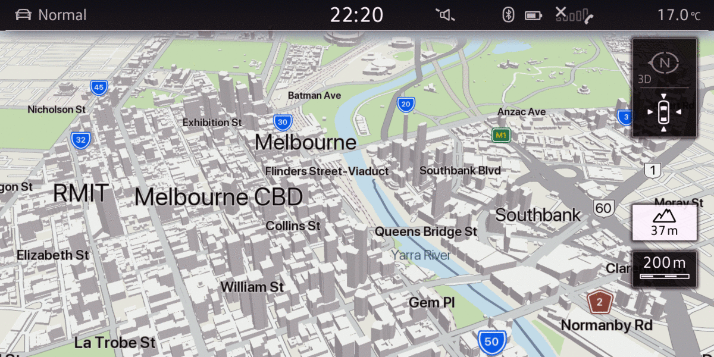

# mib2-maps
A collection of utilities to enable simpler customisation of the MIB2 MapStyle files for Volkswagen MIB2 Headunits.


### Built With
* regret
* angst
* typescript
* photoshop's colour picker

## Getting Started
The quickest way to get started is to download the latest [release](https://github.com/hgnme/mib2-maps/releases/latest) and copy it to your MIB2 headunit.

If you would like to build the maps for yourself, simply clone the repo and run the [deploy_scp.ps1](utilities/deploy_scp.ps1) powershell script. This will build a "Deploy folder" which can be copied to the MIB2 headunit.

### Prerequisites
* npm

## Build/Deploy instructions
### Using the Deploy powershell script
The Deploy script will compile the .mxf files for both Day, Night mode as well as Kombi and High-Resolution headunit formats (800x480 and 1280x640).
1. Clone the repo
   ```powershell
   git clone https://github.com/hgnme/mib2-maps.git 
   cd mib2-maps
   git submodule init 
   git submodule update
   ```
2. Install NPM packages
   ```powershell
   cd mib2-mapbuilder 
   npm install
   ```
3. Run [deploy_scp.ps1](utilities/deploy_scp.ps1)
   ```powershell
   .\utilities\deploy_scp.ps1
   ```
4. The complete map folder will be output in .\deploy.
   ```
   mib2-maps\deploy
    ├───exitview
    ├───Font
    ├───gui
    │   └───1
    ├───guidanceview
    ├───intersectionmap
    ├───MapConfigs
    │   └───1280x640
    ├───Models
    ├───pcconfig
    ├───poi
    │   └───_replace
    │       └───petrol_stations
    ├───res
    │   └───strings
    ├───roadicon
    ├───signpost
    ├───textures
    └───tti
    ```
5. copy the contents of this folder to ```/mnt/app/navigation/resources/app/vw/aus/``` on your MIB2 headunit. Remember to replace the ```aus``` folder with your region of choice.

Optionally, you may use the ```-deploy``` flag when calling ```deploy_scp.ps1``` to automatically copy the files to your MIB2 headunit during compilation. The ```-backup``` flag will also create a local copy (backup) of the existing deployment on the headunit before deploying.
This assumes a pre-configured SSH host of "mib2" with identity pre-configured.
```powershell
.\utilities\deploy_scp.ps1 -deploy -backup
```

### Configuring mib2 SSH host
Add the below to your ~/.ssh/config file
```
Host mib2
  HostName 10.173.189.1 # put your MIB2 IP address here (usually 10.173.189.1)
  User root
  IdentityFile ~/.ssh/id_mib2 ## Replace this with the path to the private key you previously configured
```
